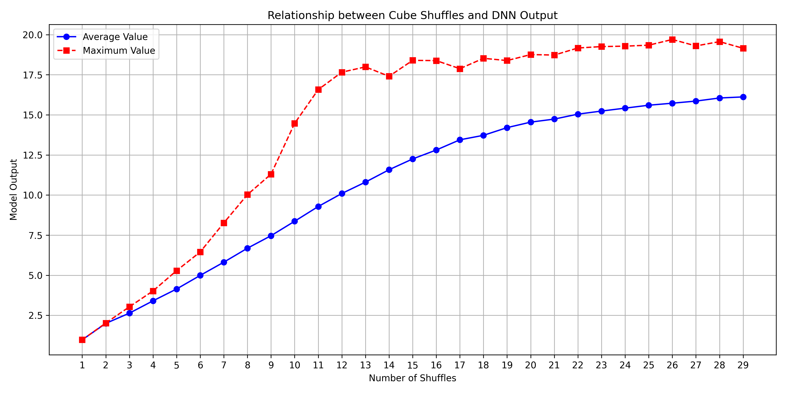

# DeepCubeA: 基于启发式搜索的魔方求解器复现


## 项目概述

本项目是 [DeepCubeA](https://cse.sc.edu/~foresta/assets/files/SolvingTheRubiksCubeWithDeepReinforcementLearningAndSearch_Final.pdf) 方法的复现，训练使用 PyTorch Lightning 框架。该方法结合深度强化学习和搜索算法来解决魔方问题。原始论文展示了如何通过结合神经网络和搜索技术来解决复杂的组合优化问题，如魔方。

## 安装指南

### 训练环境

- Python 3.10.16
- PyTorch 2.5.1
- CUDA (可选，用于加速训练)

### 安装步骤

1. 克隆仓库：

   ```bash
   git clone https://github.com/xiaofeng218/DeepcubeA.git
   cd DeepcubeA
   ```

2. 创建环境并安装依赖项：

   ```bash
   conda create -n deepcubea python=3.10.16
   conda activate deepcubea
   conda install pytorch==2.5.1 torchvision==0.20.1 torchaudio==2.5.1 pytorch-cuda=12.1 -c pytorch -c nvidia
   pip install -r requirements.txt
   ```

## 使用方法

### 训练模型

```bash
python train.py
```

### 求解魔方

下载训练好的 [final_model_K_30.pth](https://drive.google.com/file/d/1jdmdoXkkJb7sNq6oy-iudtnVIgQXDsLl/view?usp=drive_link) 模型，将其放在checkpoint文件夹下。

注意修改 `config.py` 中的 model_path 为 `checkpoint/final_model_K_30.pth`

#### 1. 推理

随机打乱魔方并求解：

```bash
python inference.py
```

指定初始状态求解，可选 action 为 `U, R, F, D, L, B, U_inv, R_inv, F_inv, D_inv, L_inv, B_inv`，多个动作之间用空格分隔。

```bash
python inference.py --actions "U R F D L_inv B_inv"
```

运行`inference.py`脚本后，会生成一个HTML文件 `rubiks_solution.html`，用于可视化求解过程。

#### 2. 网页应用

运行 `app.py` 启动网页应用：

```bash
python app.py
```

在浏览器中打开 `http://localhost:5000` 即可访问网页应用。

### 配置参数说明

主要配置参数 (在config.py中定义)：

- `--batch_size`: 训练批次大小 (默认: 10000)
- `--num_workers`: 数据加载线程数 (默认: 16)
- `--K`: 最大打乱次数 (默认: 30)
- `--max_epochs`: 最大训练轮数 (默认: 100)
- `--learning_rate`: 学习率 (默认: 1e-3)
- `--convergence_threshold`: 收敛阈值 (默认: 0.05)
- `--compile`: 是否编译加速模型 (默认: True)
- `--model_path`: 模型路径 (默认: `checkpoint/final_model_K_30.pth`)
- `--actions`: 初始状态动作 (默认: `""`)

## 实现细节

详细的实现方法和算法说明请参阅 [Implement.md](Implement.md) 文件，包括：

- 魔方状态表示
- 动作表示
- 深度近似值迭代算法
- 训练伪代码
- BWAS搜索算法
- 神经网络架构

## 结果展示

### 训练结果

不同K值模型收敛（损失小于0.05）所需的epoch数（`1000 step/epoch`）：
  

可以看到，模型收敛所需的训练epoch数随K的增加呈现出指数级增加的趋势，考虑到复现成本，在 K>15 之后，我们并未再
让模型训练到收敛（即损失小于0.05），而是限定最大epoch为20.

### 测试结果（K=30训练获得的最终收敛模型）

#### 模型在不同打乱次数下状态输入的cost-to-go预测值统计（平均值，最大值）

  

#### 测试样例：打乱100步的魔方，求解结果及所需时间

由于我们的模型并未严格按照原文中设置的收敛域进行训练，因此模型能力会一定程度上弱于原文中的描述，下面是一个魔方求解案例：

| 指标 | 值 |
| --- | --- |
| 打乱步数 | 100 |
| 解决方案路径长度 | 23 |
| 求解时间 | 7.2420 秒 |
| 解决方案路径 | `['R_inv', 'U_inv', 'B', 'F_inv', 'D_inv', 'F', 'D', 'U', 'F', 'U_inv', 'L_inv', 'F_inv', 'R', 'F', 'D', 'F_inv', 'R_inv', 'D', 'B_inv', 'R', 'R', 'D_inv']` |

[查看魔方还原过程](https://xiaofeng218.github.io/DeepcubeA/assets/rubiks_solution.html)

#### 性能分析

构建了200组打乱1000-10000次的魔方作为测试集，使用A-star算法进行求解：

> - 总测试数：200
> - 测试硬件：NVIDIA A100
> - 超参数：N=1000，$lambda=0.6$
> - a-star搜索最大迭代次数：200
> - 成功求解数：191
> - 成功率：95.50%
> - 测试集平均打乱次数：5446.30
> - 平均解长度：22.30
> - 平均求解时间：13.10秒
> - 最大解长度：25

## 引用

如果您在研究中使用了本项目的代码，请引用原始论文：

```bibtex
@article{agostinelli2019solving,
  title={Solving the Rubik’s cube with deep reinforcement learning and search},
  author={Agostinelli, Forest and McAleer, Stephen and Shmakov, Alexander and Baldi, Pierre},
  journal={Nature Machine Intelligence},
  volume={1},
  number={8},
  pages={356--363},
  year={2019},
  publisher={Nature Publishing Group UK London}
}
```
